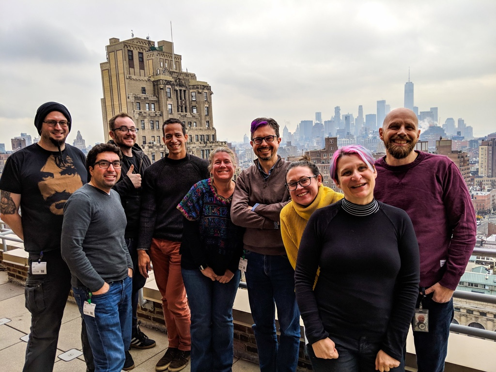

# MDN Product Advisory Board F2F Meeting, January 2019

Attendees: Daniel Appelquist (Samsung), Jory Burson (Bocoup), Dominique Hazael-Massieux (W3C), Meggin Kearney (Google), Patrick Kettner (Microsoft), Chris Mills (Mozilla), Robert Nyman (Google), Ali Spivak (Mozilla), Kadir Topal (Mozilla).

Guests: Dietrich Ayala (Mozilla), Philip Jägenstedt (Google), Shi Li (Mozilla), Joe Medley (Google), Florian Scholz (Mozilla)

Regrets:

## Logistics
* Date/Time: January 17-18, 2019
* Location: Google New York office, 111 8th Ave, New York, NY 10011

## Thursday, January 17

* 9:00 Arrive at the Google NY office & check in
* 9:30 Welcome & Orientation
* 10:00 2018 Review (Kadir & Chris)
* 11:30 Lunch
* 13:30 MDN in 2019
  * MDN OKRs and strategic goals
  * Tech Plan
* 15:00 Developer Needs Survey (Kadir, with Philip Jägenstedt and Dietrich Ayala)

## Friday, January 18

* 9:30        Browser Compatibility (Florian Scholz & Philip Jägenstedt)
* 11:00         2019 Content plan
* 12:00        Lunch
* 13:00        Working sessions
* 16:15         Closing messages, agreements, and commitments

## Meeting Notes: Day 1

### Introductions, goodbyes, and new members

We did introductions, and welcomed our newest PAB member — Jory Burson (Boucoup)!

We also gave a shout out to Erika Doyle Navara, who has left the PAB due to accepting a new job at Microsoft in a different department. Patrick mentioned that Microsoft will be nominating a new member to replace Erika.

### 2018 recap (Kadir and Chris)

* MDN 2018 objective (from Mozilla) — 30% year-over-year user growth. This was a two pronged strategy. User task completion rate = 90%, so not much to do here
  * Prong #1: Engage a new segment — action-oriented developers — with interactive samples
  * Prong #2: Get MDN into workflows by integrating with other sites/tools, starting by moving MDN content to be machine readable. Started with compatibility data in 2018.

We reached a 21% year-over-year user growth and 13.3 million monthly users. User numbers dropped quite a bit over the summer. Some of the drop was due to Firefox, which had been running content tiles pointing to MDN but dropped these in May/June. This accounted for ~500k users, but they were low-value users — 90+% dropped after only 10 seconds.

#### We completed our interactive examples for JS, CSS, and HTML

* Now starting work on Web APIs — 2000-3000 pages, much harder to implement interactive samples here due to more complex code and sheer numbers..
* Experimenting with Codepen, they have client side and also embedded content. Working with their team to figure out if it will work for MDN.
* Why not Glitch? Mainly Codepen is preferred because Glitch is a heavier implementation, more performance impact (we have talked to them however, and we are still interested in looking into ways we can work together)
* Broke down Web APIs into 2 top tier types, DOM APIs and “PWA-type APIs”, such as service workers, Push, etc.
* MDN engineering was only 3 devs over most of 2018 (we did add an additional developer late in 2018) so really resource constrained
* Plan is to use the home grown solution (CSS) in conjunction with CodePen. Might switch to CodePen for HTML, and definitely for Web APIs.

#### Performance improvements

* We worked with Tim Kadlec on performance, first an audit and then taking the resulting recommendations forward to make changes to the site.
* We cut page size in half, page load down to 4.3 seconds generally worldwide. This didn’t seem to have much impact on performance?
* Cutting out unused CSS & Inlining critical CSS will likely have the most impact, but it won’t be easy & requires a pretty big technical shift on the dev side. Will tackle this in 2019.
* MDN platform is a homegrown solution, a lot of technical debt.
Have a contract with Tim to do the implementation. Trying to figure out how to do this — deciding on whether to wait on this until other MDN front end implementation is done.
* Ali is now managing MDN engineering as of the end of December 2018. We’re planning to grow the team in 2019, figuring out how to get more people as there won’t be able to hire HC so need to use program dollars — long-term contractors. There are back-ups if Tim is not available at the time.
* Tim's contract is completion/milestone-based not time-based. He is considering taking a break after February to work on some other things.
* We are running a Hack on MDN event in April, centered around Performance, alongside the Perf Matters conference. These are being run twice per year (we already have another a11y one being run in May) and they are going really well.
* The picture at the country level is quite different (7-9 seconds) the speed of the computers are the issue not the connection. This means competition with w3schools because on slower computers they are faster than we are. They are more static. We have extra CSS parsing on every page load.

#### Workflow integration
* We implemented links to MDN in Firefox dev tools for JS error messages first, then added CORS error messages in mid-2018. Getting some traffic for CORS errors but not as much as we might have expected (JS Error messages are 10x higher). Looking at pure numbers on the MDN side, only tracking sessions coming from DevTools. Would be great to correlate those numbers.
* We would like to do these types of integrations into other tools beyond Firefox DevTools. Google PAB members met with the Chrome Dev Tools folks a few times, but did not show them the source code or it in action in Firefox Dev Tools. Mostly discussed browser compatibility, might be some opportunity to show the error messages to see what they think.
* User satisfaction for the error messages is very high, which is what drove us to extend them into other areas.

#### Browser compatibility
* We switched to new compat tables in 2018, and are updating the table style again, as users let us know they didn’t like having just the icons & want text (can be difficult to distinguish between icons)
* All the data is migrated to GitHub; most of the 5% left out is the events documentation; this was intentionally left out because events docs are a mess (they are being fixed in 2019 — we are putting events pages/data in with their respective interfaces)
* Now we can look into improving the quality of the data — it’s fairly low. * We are looking to improve both availability and specificity.
* When we looked through the user research feedback, a lot of people said “Yes” is ambiguous and doesn’t provide information about when it was first supported (2 years or 2 months?). Even for Chrome, people care about when it was added — they don’t care so much about about the release number; they want to know how long a specific feature has been supported. Version numbers can also be quite an issue. We are doing research on how to best display the information — too much is as bad as too little.
* VSCode added MDN CSS syntax data, then in the next edition added MDN CSS Compatibility data. We have started moving MDN CSS short descriptions into a machine-readable format so VSCode can use them; we are working in this in Q1 2019.
  * Migration work is being driven by interest from outside groups/tools.
  * MDN localization work is entirely volunteer based, so having the localization contributed by Microsoft is hugely helpful. MS frequently works with local governments to make sure they have translations into local languages.
* We need to go through all of the short descriptions and make sure they follow a standard format, then scrape them into the github repo. We will then look at the changeset, review, and make changes if needed in the wiki and port into the repo.
* In the end all such data will be on GH…there’s a project we call stumptown, which we will get into in our 2019 planning. This will be a 3-5 year project, and is currently in an experimental phase.
  * We’ll start with a small chunk of pages (e.g. HTML) and experiment with that.
  * We’ll talk about this when we get into what we’re thinking about for 2019
    	* Open question: Is there any way MS/GitHub or other contributors can help?
  * In terms of editing pages, there’ll be a conceptual switch — going from immediate results in the wiki to delayed results with a PR in GitHub.
  * Another issue will be doing previews on GitHub due to macros and other things; we’ll need to look into ways you could do a preview without relying on the full infrastructure. Still need to figure this out. Could make part of the CI process.
  		* Patrick can help as an intermediary with Github if their help is desired.
  * Lots of issues to solve around localization
  * How would this affect regular contributors? We have 80k in total, but most do very occasional drive-by edits. The core set of people — monthly editors — hovers around 1000 in number. Mostly they make small changes. 100 or so are highly active, mostly localizers.
  * No built-in communication tools on the MDN wiki; this would be much better under a Github model.
  * Resources for community management? Learning from browser compatibility and other areas on GitHub. Considering expanding responsibility beyond MDN paid staff for PR review (like core maintainers).
  * Can some of the groups like JSF and ECMA help out? Could be something to look into.

#### Payments on MDN
* We Looked at a bunch of revenue opportunities — ads, job boards, but they were not feasible or desirable.
* We did an experiment with Guardian-style contributions; we asked for financial support from users.
	* Showed a one-time payment ask banner to random 1% of users, launched in October.
	* Monthly payment option launched in December to a random 3% of users.
	* Started with registered beta testers, then rolled out to random 1% worldwide. English, US$, credit card payments only.
	* California has strictest monthly subscription regulations in the US (and likely world)
	* The goal was to make sure we could accept payments and be able to gather data on click through rates. Which turned out to be 0.3% of pageviews. Much higher for returning users. This is remarkably consistent on MDN (seems that .03% of people will click on almost anything).
		* Not optimized at all.
		* People seem more comfortable with one off payments (130+ so far) than monthly payments.
		* Monthly is now default, has driven down one time payments
			* We should look at Wikimedia data about donations for more insight
	* In 2019 we will do more optimization and improvements. Analysis ongoing.
		* Monthly payments have a lot of steps if you don’t have an MDN account it requires creating an MDN account, and that requires a GitHub account, so there are a lot of steps and barriers. All of this needs to be optimized.
		* Have we looked at WebPayments? Specifically working with Stripe on web payments, which would help optimization.  
		* If you are already signed up with Stripe, and already have an MDN account it’s very easy. Otherwise not so easy.
	* Very few users have MDN accounts as it is mostly needed for editing content, and most people don’t.
	* Unoptimized, less than 1 million a year in revenue.
	* Way to link to MDN that would force the popup? Yes, there are url params

#### MDN Content in 2018
* [Detailed info here](https://docs.google.com/document/d/1QfdWCO3wAy1H-zc6fZbTpw8sTS5Kq7E8IZYEp_trooI/edit#heading=h.54m3xork59jg).
* We generally try to keep up with Firefox releases. We use ddns (dev-doc-needed) keywords in Firefox engineering bugs. Each team member used to receive a laundry list of ddns, which was frustrating as it required a lot of context switching. We changed to a new system with a content road map containing topic areas with prioritized set of features. Now we do multiple ddn bugs at a time, tackling whole areas in one go (e.g. a CSS spec, or JS API).
* The [Roadmap Trello board](https://trello.com/b/LFl3umOX/mdn-content-roadmap) is open to the public, so volunteer contributors can access it and find things to do. Florian is talking to some TC39 folks about helping out on some of the new JS content.
* [Code sample guidelines](https://developer.mozilla.org/en-US/docs/MDN/Contribute/Guidelines/Code_guidelines) authored.
* [Web-related tech section](https://developer.mozilla.org/en-US/docs/Related) was started — technologies that don’t fit into MDN’s core remit (web technologies, technologies that are supported by web browsers), but are still interesting to web developers. Came out of  from PAB conversations; [IMSC](https://developer.mozilla.org/en-US/docs/Related/IMSC) was the first doc set to be added.
	* EPUB3 is another potential set of docs to add; conversations starting in early 2019.
* We now have linkage between standards/spec work and MDN — now have an “impacts documentation” label on the WHATWG GitHub.
* We moved to [GitHub for sprints](https://github.com/mdn/sprints/) + reporting docs bugs
* MSDN content migrated to MDN.
* One of Erika’s last bits of work was to migrate a whole bunch of proprietary microsoft features across to MDN, so they are recorded.      
* We’ve undergone a process shift — focusing more broadly across the industry, not just FF/Gecko releases. Not a massive change but a few things are done differently. For example, scroll-snap is not implemented yet in Fx, but it is in Chrome, and has industry buzz. Rule of thumb: is it implemented in more than one browser, and/or is the spec stable?
	* MS shift to Chromium will impacted that too.
	* Webkit not at the table, but critical along with Samsung.
	* We need a tool for situational awareness to raise when something needs to be documented
	* In the task completion survey, 6% of respondents reported that they are there for the compat data.
	* There was some data on frameworks in a MDN user survey run in November 2017, but don’t have anything more up-to-date. We know most users are using some form of framework.
	* From a content strategy point of view, we should address frameworks and how they are covered on MDN. We are not resourced to cover them all. Being user-centric, it is really hard if you don’t equate your docs to the frameworks people are actually using. We could potentially do things with tabs where you could toggle between vanilla JS and frameworks, for example.
	* Instead of bringing frameworks into MDN, would it be possible to work with the framework communities to manage the samples themselves but standardize on the core MDN docs. This is something to explore — maybe do a survey with framework communities. There might be an opportunity here.
	* As a note, pages on MDN currently don’t account for frameworks at all, so including samples would lack context.
	* Might be opportunity to include this in our Github experiments (as far as documentation structure, stumptown, etc.)
	* A question that was asked — would MDN have wider appeal as a documentation platform along the lines of readthedocs? Not at the moment as current platfomr is tricky to maintain, but perhaps once we move to the new-gen MDN, we could reconsider. The expertise the MDN team brings would offer tremendous value here.
	* JS — haven’t done much updating as topic owner (Florian) has been busy on other projects. We could use help here, although Florian is getting back into it in 2019.
* Web APIs — we could always use help here, but contributors would need some mentoring.
	* Among other things, we contracted Ruth John to do some great updates on the Web Audio documentation.
* We did a bunch of Firefox DevTools documentation — Mozilla funds a tech writer to work on docs, which are still hosted on MDN. The plan for 2019 is to move these docs to a new Firefox developer docs site.
* Web Extensions — Microsoft was very interested in Web Extensions standards prior to the move to Chromium, but is now evaluating how much support will be given going forward. We are keeping up to date with the docs, but we are not sure what to do with them at large — we want to move them over to the aforementioned Firefox developer docs site, but it is not so clear cut as DevTools — it is partially web standards and partially proprietary features.
* Last of all this year, we did a bunch of macro removal work, to make the content simpler and more portable, and the platform easier to maintain. We cut the number of macros from over 1k to under 300 last year.

#### Other useful conversations in this section

It might be a possibility to discuss JS/framework content on MDN with members of relevant communities at the Node + JSF Collaborator Summit (as JSF and Node are merging). This is happening May 30-31 in Berlin, right before JSConf EU. There will also be a TC39 meeting in Berlin after JSConf. Jory & Dan & Chris could follow up? Have a call to work out next steps for this MDN and frameworks exploration concept.

Joe's idea — sharing content between explainers and MDN "Using..." guides (and possibly "concepts and usage..." sections.) Joe, Chris, Daniel, and Alice Boxhall all agreed with this idea. Next step: work out template for these docs and when an MDN writer would fit into the explainer process — offer their expertise up to help make a better explainer in the first place, before it is then reused for MDN content. We did something similar with the Payment Request API explainer, which [now lives on MDN](https://developer.mozilla.org/en-US/docs/Web/API/Payment_Request_API/Using_the_Payment_Request_API).

We ought to sort out specification tables (conversation between Joe and Chris):
* Pull out the middle column of the table? The status does not match with the linked specification, this is confusing? Why bother.
* Have a "Feedback" column to provide a link to the GitHub issues or whatever where you can give feedback on that spec.
* Don't have a notes column unless you need it (e.g. when you want to make it clear that one method has been added, or whatever)
* Have a note available somewhere that explains why we reference the latest editors draft, and not the stable published draft

Next steps: Chris to share these ideas with the MDN team, get feedback, make a decision to go forward with.

### MDN in 2019 (Kadir)

Mozilla’s organizational level OKR’s are still being finalized, so we’re only able to talk about the plan and high level roadmap for the moment.

We will share what MDN has proposed, but note it’s subject to change. PAB feedback will be incorporated.

* {conversation about differing things under consideration}
* Broadly, three objectives:
	1. Building a revenue model that supports growth of MDN into new areas, specifically subscriptions. Figuring out what we could offer that would be valuable to developers. Will focus on subscriptions, adjacent to web docs. Will not put MDN Web Docs behind a paywall.
		* Board members would like official pledge that all subscription $ are reinvested into MDN
		* Leaning towards education focus - individual, corporate, etc, includes looking at Partnering with existing providers
		* Jessica Rose starting at Mozilla Feb 1, will be focused on engagement - both the MDN subscriber program and volunteer programs like Mozilla Tech Speakers
	2. Understanding developer needs and how we can drive more adoption of the web platform
	3. Shifting focus of MDN work from pure user growth to user engagement

We want to have people logged in to MDN accounts for conversion to contributors or subscribers. New engagement strategies are required because there is a limit to growth (20-40% growth y/y not sustainable)

We need to build relationships with those people, and we want to do this by building personalization options for MDN users. It would be useful to have developer profile data consumable by browsers — we would have to figure out how to ethically do this. A move to GitHub would help.

We have to be conscious of impact and issues around MDN accepting money, and willingness of board members to contribute time to MDN if it looks like their work is making $ invested in Firefox, for example (this shouldn’t be the case — the money should be invested back in MDN. But just suppose).

Personalization is challenging from a technical perspective. MDN is a wiki and designed for a static interface. Changing that requires infrastructure changes to accomodate personalization and more user accounts.

* There is a lot of technical debt; the engineering team has been pushing for us to move to a modern JS framework (e.g. React & Jest).
* Currently the ability to run tests is also pretty bad; the macro system is also very fragile.
* We are looking to decrease time taken for platform infrastructure pushes by an order of magnitude (pushes currently take ~2 hours).
* Biggest risk: in 1-2 years we determine there is no way we can make $ off of MDN and we essentially return to where we were in 2018.

### Developer Needs project (Dietrich)

We are planning to run a regular developer needs assessment survey on MDN (and beyond), to establish the biggest pain points of web developers — not just of MDN, but rather of the web platform, the available tools and technologies, etc.

The first stage of this project is research into developer needs; this hasn’t really been done in a way that spans across industry/browsers; mostly internal projects inside companies. We have data from individual web platform areas, etc.
* We have some useful data from places like Stack Overflow, etc.
* We have talked to people writing standards about how they get their input and select what standards features to work on. A lot of it comes from momentum from pre-existing efforts, or bugs, backlog, prototyping in browsers, etc. Most developers won’t file bugs, and if they do try the process of getting your feedback heard isn’t easy. This results in a lack of visibility for developers and designers, by the people writing standards and building browsers.
* MDN has broad reach, and a sense of objectivity that gives a level of trust that might not be present in other products/vendors.

We want to look at designers and developers on and off the web. We originally looked at who is not developing for the web & why they are locked out of the web, but eventually decided to place them into a different segment, and first focus on people currently developing for the web and what they need to keep targeting the web platform. We have not done a real segmentation of those not on the web — it’s a longer term effort, and we would need help from vendors with access to this audience.

The target audience for this assessment is:

1. Browser vendors.
2. Standards bodies, frameworks, other ecosystem members

The PAB makes sense to get involved with this because it’s a broad representation of browser vendors and others. We want the authentic voice of developers, not colored by business needs or opinions.

Question: What about Apple? Is there a way to loop them in? We have contacts, will keep them informed and invite them to participate.

Some points about the report. We:

* Are planning on publishing the report on MDN.
* Think it is important to make report available publically.
Want to make sure that the output is actionable by browsers.
* Could come up with a single number, like a “web love” score. Web love increased by X…
* Selected pinpoint as the survey company. Did pain points in IoT research with them 2 years ago. Will share that research done then so members can get an idea of their work.
* Are Hoping to have the survey out at end of March, results in Q2.
* Want to make sure the survey can be amplified into other communities the board members participate in.
* Will track where answers are coming from — different channels for outreach.

Questions about survey content:

* Would we ask a question about what browser cause the most pain? Prefer to not have popularity contest, we all are familiar with developers saying they don’t like IE6 so that isn’t helpful. Discovering the pain points in their daily work would be more helpful.
* Is there a place for questions on language features, e.g. JavaScript?
* Some questions were asked about what is meant by designers in this context — web designers, people who write code. Not graphic designers or illustrators…?

For the output, we’d want the ability to create a list of prioritized needs in the ecosystem. Will broadly represent an aggregate view across people who come to MDN, from beginner to advanced. Goal is to create a shortlist.

How the questions are asked is really important. It is difficult for example to correlate data between things like CSS Grid and compatibility.  If they are too high level the result often isn’t actionable, but too low level isn’t comparable year-over-year.  Can we find the right set of questions? One aspect is getting feedback from the people who will use the information, and the other is iterating on asking the questions to the audience.

It is a challenge to take action based on the survey: telling PM’s that their priorities are wrong is often not productive, etc. We’d look at survey as a signal, one of many.

Actionable points to begin with:

* We will start with qualitative interviews to validate questions, survey, then another set of qualitative surveys to validate results.  
* It would be good to connect with the RICG (through e.g. Mat “Wilto” Marquis) on this and get their support. They havbe been through some similar things in their research about “responsive” issues.
* Feedback loop, what will the process be:
	* Do qualitative pilot research to get an understanding of what goes into the survey
	* Design the questions
	* Share the questions with stakeholders
	* Get feedback & incorporate it
	* Run a small pilot survey to make sure people taking it understand the questions, etc. Review again, adjust as needed.
	* Run full survey.
* Think about the demographics carefully — will there be outreach to underrepresented communities?

## Meeting Notes: Day 2

### Browser Compatibility Data project discussion (Florian, Philip Jägenstedt)

The BCD data has now all been [migrated into GitHub](https://github.com/mdn/browser-compat-data) (except for the Events information, which is being fixed in 2019, then added.) Joe Medley has contributed significantly to the Chrome data in 2018.

#### What do OKRs for data look like?

* Not finalized, but a likely KR is to update and maintain the data for a set of key browsers.
* Another KR will likely be around automation opportunities. We won’t block on this, as we can manually get the data cleaned up, but we want to make sure it stays correct. Need some sort of tool or automation.

Specific data issues:
* Ideally needs to be correct at the version level. Many people are confused by what “Yes” means. Even a version number can be confusing — most people don’t know exactly when a particular version was released.  Release dates are in the repo, so it would be possible to display them if desired.
* “At least version x” is also problematic, not a real solution.
* Android and WebView are difficult, because they now share the codebase with Chrome desktop, but didn’t always.
* It’s almost certain there will be gaps in knowledge.
* Developers often know the version number of what they are using, but might not know other browsers. Some, like Chrome or Firefox, are seen as evergreen & less dependant on version numbers (in contrast to IE) . Or they know the version number but not the release date and how long ago it was.
* 95% of users develop on desktop, so less focus on mobile experience for BCD.
	* We might want to measure the failure rate for mobile users vs gross mobile use.
	* The content should be usable everywhere, especially things like tutorials or things you’d read when not actively working.
	* In India and China, about 20% of traffic is on mobile; there’s much less MDN mobile usage in the US.
* In terms of release dates, we discussed whether there could be way for users to toggle between date-relative and version-relative data. We did some user research having people looking up compat data on both MDN and caniuse, which has both data views available, but defaults on version-relative. They always use the default option on caniuse.

#### Data quality

The next step is to improve the data quality:

* It’s a largely manual process, want to start automating, it as much as possible.
* Google has Confluence tool, uses BrowserStack. We are looking into how we could use this.
* Other ideas are to use web platform tests or other tests to help turn data into compat data.
* Looking for help from the PAB to get data correct for their respective browsers.
* Safari coverage, in particular, is not great.
* Have talked to Apple, there is interest but not much progress. Have fixed some issues with how Safari data was presented.
* Microsoft — not sure how to handle the shift to Chromium. We need to look into this.
* Also this year, we want to personalize data in compat tables — you will be able to specify what browsers you want to see in the tables by default through your profile if you are logged in.
* VSCode is interested in these kinds of upfront things, give requirements and possibly get heads up and potential solutions.

What would the value be of 100% accurate data? Developers say compatibility issues are one of their top issues. They have no detailed info on how compatible their code really is, getting BC data integrated into tools like Lighthouse would help address issues.

Microsoft has found developers assume data is correct, and think of it being authoritative.

**Note: Commitment to update web compat data is written into the Samsung teams’ plan for the year. Nice work Daniel!**

#### Focus on CSS data

It was asked why we should focus on CSS as a first priority? This is largely because of VS Code integration, and because CSS is in better shape than some areas (API compat data is probably in the worst shape). CSS compat data also has a lot of interest as it’s not easy to do feature detection.

#### Automation discussion

Google has web platform tests that are supposed to be comprehensive, and want to expand the coverage over time, either annotating existing tests or BCD+IDL generating existance tests, amenable to automation.

We probably can’t automate entirely on web platform tests because it looks at a lot of edge cases — if you do it indiscriminately it would tell you nothing works in any browser. It can give a hint if you need a note in the BCD or something like that. Do a comparison to see what you need to look at, treat as a signal.

We could get rid of most nulls using automation — not a solution to all our problems, but greatly improved.

How soon after something goes stable can we expect new BCD to be generated? Daily. Sounds like delay would be less problematic than expected.

We won’t come up with an immediate solution here. We first need to define our automation story. We need to define quality — it would be good to have an actual number here; driving it down is a good way to measure progress and solve a real problem.

Once this is done, we should get together and discuss resourcing.

### 2019 Content Plan (Chris)

Chris first looked at the upcoming content work, walking the group through the trello board w/ 2019 content, and discussing the additional notes in the OKR doc looking at key areas that will be documented, such as the CSS Houdini APIs, and WebXR.

#### Maintenance

Chris is keeping a spreadsheet that aims to record “tier 1” maintenance content (i.e. pages that are important enough to require a regular round of maintenance), pulling data in from MDN to get relevant data. Working out exactly which pages are tier 1 is a work in process. One part of this is trying to figure out a scoring mechanism (e.g. page views plus satisfaction plus whatever else).

A surprisingly small percentage of Web API pages make up most of the traffic (25% or something). For the “long tail” pages that aren’t used very often, we could maybe break them up by API, see if the standards/spec groups would help maintain them.

Further to this, maybe we could have a milestone for MDN in the review process — being correct on MDN would be a part of the W3C process. Could probably do something similar for ECMA/TC39 as well. Would add serious extra value if the most used (“tier 1”) pages were checked by the spec owners.

In terms of tier 1 page sets:

For smaller page groups we might just do them all.
For larger page sets, maybe just say “let’s maintain the pages that make up 75% of page views for this section”. Also ask spec groups if they want to help maintain the pages for their specs.

Some really obvious problem areas, like the event reference, really need to be updated. We have a plan for fixing these — bringing event pages back into the main API reference, hanging off relevant interfaces.

Other notes:
* The [MDN learning area](https://developer.mozilla.org/en-US/docs/Learn) has tripled in terms of its share on MDN traffic in the last 2 years. It now sees nearly 10% of traffic.
* Web Auth full recommendation should be due in W3C next month — the [documentation needs editing](https://developer.mozilla.org/en-US/docs/Web/API/Web_Authentication_API).
* For a learning area GitHub module, we should look into trygit. Comes from same camp as tryruby, etc. pluralsite bought it, but this was not maintained. Talk to Jory more about this)
* When documenting new APIs, etc., maybe send an “intent to document” mail about it to the PAB list so we can make sure that no toes are trodden on.

### Microsoft Edge moving to Chromium
* Currently in the research phase; lots of decisions still need to be made/finalized.
* When it is implemented on Chromium, the update schedule could potentially impact MDN browser-compat-data. In theory there should be a minimal API deviation from Chromium, but still TBD. Should have enough warning to build time into content roadmap.
* Microsoft still committed to web platform & MDN PAB.
* Will nominate a replacement for Erika since she is taking a different position in MS.
* Not sure what will be happening with the Tech Writers who were contributing to browser-compat-data; Patrick will check and let us know.

### MDN View Source conference — content discussion

Broad stroke talk topic discussion

* Getting different browser engineers / facilitate cross-dev conversation.
* Like the format of the blink.on event, formal talks one day and then working sessions would be nice.
* Moderated panel with user-submitted questions (please no talking heads).
Would there be room for breakouts? Yes, but confirming with site visit in 2 weeks.
* More Interactive sessions vs. having marquee talks.
	* Some input may come from the developer needs assessment.
	* We could present the outcome of the survey, show the impact of the survey on the MDN plan moving forward, maybe do this on an annual basis.
* Plan to discuss deeper content ideas at a future call.
* More “engin-y” content E.g. what makes Samsung Internet different.
* Set up doc with ideas and options for content, what we are ruling out.
* Can we get some of the TPAC folks to attend? “Meet the standards people”.
* See if we can repeat some of the Firefox Gecko lightning talks/brown bags.
* Framework panel would be very interesting.
* Figuring out the topics and making sure we can get dev rel people booked asap would be good. They tend to be in high demand.

Curation vs. call for presentations — still not sure, but want to collaborate with Fronteers to make sure that there’s not too much overlap.

D & I tickets? I think that’s baked into our remit.

ViewSource historically is 25% scholarshipped; we need to look at travel expenses & figure out a budget.

We should try to make this more unique; not YAFEC (yet another front-end conference)
* Live band on stage doing all the intros and outros :D
* Making this more of a feedback/testing process
* Content idea: where to file certain types of bugs/issues (on the spec, engine, etc)
* Need to figure out a way to get some of the community there.
* Bath bomb conference swag! Made into shapes of different browser vendor logos.

We want to downplay the google presence so it’s more of a level playing field and doesn’t come across as biased
* Google IO/Chrome Dev Summit. The availability is the biggest piece.
* Loved the way they had the tents set up at IO to go ask the engs questions

We’d like to bring in more Chinese browser engineers, e.g. UC browser? Get them to engage (maybe bring in a translator)
* What would they get out of it?

Sponsorship — this is also coming together. Will have partners/core sponsors.

### MDN.dev
* Google Registry is going to release the .dev domain early this year
developer.mozilla.org would be a link to all the mozilla dev resources.
* Content for mdn.dev would initially be a page that talks about development of MDN.
* Long term mdn.dev would become a core domain
	* Would we make another .dev domain for the survey? Maybe! Might be good to have its own domain (survey.dev?)
* 19th of Feb starts sunrise period for people to apply, it will be limited to trademark holders

## Group Photo!

## PAB direct impacts

* MDN team reporting compatibility data on a wider number of browsers, e.g. Samsung Internet.
* Collaboration on browser compatibility data, contribution from browser vendors to make information more accurate
* Content prioritization that reflects broader set of browsers (beyond Firefox)
* Access to experts across different browser vendors, for hard to find documentation details. This is really useful.
* Better linkage between Specs & MDN Docs.
* VSCode connections at Microsoft, MDN data integration (ongoing).
* Planning for shared ViewSource event in 2019.
* Extension of MDN to Web-related technologies (IMSC, discussion for EPUB).
* MDN breakout sessions at W3C TPAC.
* MDN team connection to W3C China members, beginning discussions on translation support with local communities.

## New action items needing issues to be filed

It might be a possibility to discuss JS/framework content on MDN with members of relevant communities at the Node + JSF Collaborator Summit (as JSF and Node are merging). This is happening May 30-31 in Berlin, right before JSConf EU. There will also be a TC39 meeting in Berlin after JSConf. Jory & Dan & Chris could follow up? Have a call to work out next steps for this MDN and frameworks exploration concept. See [MDN and framework content] (https://docs.google.com/document/d/1Pmeu90QQXXdivIPVhIGZilT2n1PgpBGSeOVm3DQ2W7I/edit#) for initial thoughts.

Joe's idea — sharing content between explainers and MDN "Using..." guides (and possibly "concepts and usage..." sections.) Joe, Chris, Daniel, and Alice Boxhall all agreed with this idea. Next step: work out template for these docs and when an MDN writer would fit into the explainer process — offer their expertise up to help make a better explainer in the first place, before it is then reused for MDN content. We did something similar with the Payment Request API explainer, which [now lives on MDN](https://developer.mozilla.org/en-US/docs/Web/API/Payment_Request_API/Using_the_Payment_Request_API).

We ought to sort out specification tables (conversation between Joe and Chris):
* Pull out the middle column of the table? The status does not match with the linked specification, this is confusing? Why bother.
* Have a "Feedback" column to provide a link to the GitHub issues or whatever where you can give feedback on that spec.
* Don't have a notes column unless you need it (e.g. when you want to make it clear that one method has been added, or whatever)
* Have a note available somewhere that explains why we reference the latest editors draft, and not the stable published draft
* Next steps: Chris to share these ideas with the MDN team, get feedback, make a decision to go forward with.

Question: What about Apple? Is there a way to loop them in? We have contacts, will keep them informed and invite them to participate.

Explore possibility of having milestone in W3C spec process, of reviewing MDN docs and making sure they are correct. Start asking spec groups if they are interested in maintaining their technology's docs.

Talk to Jory about trygit, and whether we could use any of this content in our beginner's GitHub learning module.

Put in process: When documenting new APIs, etc., maybe send an “intent to document” mail about it to the PAB list so we can make sure that no toes are trodden on.

Patrick to report on replacement for Erika on PAB, and to see if the MS tech writers who contributed to MDN are still available.

## Prioritisation/analysis of previous PAB issues

### High
* Update the experimental spec warning banner to ask for feedback on the spec (Chris) — https://github.com/mdn/pab/issues/58. This is fairly easy to solve, has been discussed, and a solution suggested. Let’s put this one to bed.
* Highlight feedback loop from MDN articles to W3C specs / github repos (Chris) — https://github.com/mdn/pab/issues/25. Seems closely-related to the above. Can we get both put to bed at the same time?
Result: Pick 10 API’s and place the repo link, see how much noise is generated.
	* Next Steps: Decide 5-10 spects to try it on. Add on spec data page and use a macro to generate links. Add to MDN sprint for Chris to do the work.
* Start conversation with caniuse about MDN schema (Kadir) — https://github.com/mdn/pab/issues/54. I still think this is a great idea. No point in having two datastores if we don’t need to.
	* Next steps: Kadir reached out to Fyrd, did not get a response. Try again before next PAB meeting (June), Robert offered to ping him & copy Kadir.
* Keep info on W3C specs up to date on MDN (Dom) — https://github.com/mdn/pab/issues/19. Yes, it would be good to move forward on this.
Removing current status notation from MDN as it’s not very useful. Link to the most current spec, not a manually created status. However, state of the spec (stuck in editing, for example) would be useful.
Next steps: Chris and Joe will share proposal with PAB & MDN team. Come up with a plan if it is agreed upon.
* Further conversations about including compatibility data in editors (Kadir) — https://github.com/mdn/pab/issues/53. This is a great idea and I’ve love to see it go further, but I’m not sure if we have time to prioritise this in 2019, or if the PAB can really help here. Do we still need this issue?
	* Next Steps: Close this issue.
* Contract Bing to see how they do snippets (Patrick) — https://github.com/mdn/pab/issues/47. Sounds useful and not too hard to follow up on.
	* Next Steps: Revisit later in 2019
* Contact Daniel Davis at DuckDuckGo about their snippets (Daniel) — https://github.com/mdn/pab/issues/46. Again, sounds useful and not too hard to follow up on.
	* Next Steps: Revisit later in 2019
* Share best practices of using structured data for snippets (Google) (Meggin) — https://github.com/mdn/pab/issues/43.
	* MDN search results are looking decent these days--
	* Anyone have access to search console for the site? Anyone getting emails from search team about assessment?
	* Next Steps: Kadir to look at the report, which will give best practices. Robert can help connect Kadir with the search result team - Kadir will collect issues and send on to the Google folks to start the conversation.
* Determine if we can automate PR assignments through a GitHub hook (Kadir) — https://github.com/mdn/pab/issues/36. Useful, part of BCD governance piece. Maybe pass this on to Florian?
	* Next Steps: Florian to review the tool from Dom
	* Next Steps: This relies on governance model, which is still to be resolved.
* Provide more information on what "supported" means on MDN (Chris, Florian) — https://github.com/mdn/pab/issues/33. Useful, low hanging fruit. Should do this soon.
	* Next Steps: Chris will add this work to an MDN sprint
* Designate a point person at your org to do compat data pull request reviews (Kadir, everyone) — https://github.com/mdn/pab/issues/32. Yes, we should do this. Again related to BCD governance project Florian is working on.
* Everyone to check to see what their orgs are actually doing as far as updating compatibility data after each release. Implement a system to do this if not. Will report back on this next meeting (Daniel, Patrick, Meggin) — https://github.com/mdn/pab/issues/31. Yes, we should do this. Again related to the governance stuff.
	* Joe is point person for Google, Erika was for MS so will need a replacement.
	* Florian has proposed a governance model: https://docs.google.com/document/d/1LRRPfFFP6IYZw5SAoyjE8fIrBSz6VoeVdi_D2XeOYF8/edit#heading=h.f5wvqj5z3l0w
	* Next Steps: Chris send around again for PAB members review, approve, get the right point people connected with Florian to move forward. Follow up meeting with point people scheduled.

### Medium
* Do some triage on Microsoft priorities for Web Component docs and get back to the board members (Patrick) — https://github.com/mdn/pab/issues/6. 	* The web components docs on MDN (https://developer.mozilla.org/en-US/docs/Web/Web_Components) are fairly cool. Is anything else needed?
* JS Foundation MDN cross-promotion (Ali) — https://github.com/mdn/pab/issues/61. Sounds like a nice-to-have, and possibly low hanging fruit, but unsure of status. Did this go anywhere Ali?
	* Ali talked to Kris, he’s since left so it didn’t go further.
	* Jory can help with this
	* Next Step: Ali & Jory will talk
* Discuss getting developer feedback in APIs/usability studies (Kadir) — https://github.com/mdn/pab/issues/59. Another nice-to-have. Did this go anywhere Kadir?
* Follow up on doing a joint developer event (Ali) — https://github.com/mdn/pab/issues/56. This is a great idea, but a lot of work. A thread was started about this, but I’m not sure where it got to. Since it was followed up on, can we close this? ;-)
	* Next Step: we’re far enough along with this (MDN View Source) we can close the issue
* Look into compatibility data integration with Sonar [now WebHint] (Ali) — https://github.com/mdn/pab/issues/52. Sounds interesting, but did it go anywhere?
	* Not sure why I (Ali) was pegged for this. If someone wants to take it over that would be great, otherwise we should close.
	* I’ll take it < Dan
* Research better search result presentation for MDN (Kadir) — https://github.com/mdn/pab/issues/45. Sounds useful, but like it is a fair amount of work.
* Research implications of migrating MDN to GitHub (Kadir) — https://github.com/mdn/pab/issues/39. This is also Stumptown-related, but I’ve left this open as I think it could be useful to the project.
	* Next Steps: Ali is suggesting we close this, is an in-process project for 2019
* Meeting with Google & Mozilla about learnings from migrating docs to GitHub (Ali, Meggin) — https://github.com/mdn/pab/issues/37. This would be a useful exercise. Maybe just do it as a async exercise (get the Google folks to write some thoughts in a doc?)
	* Next Steps: Close this. Ali will connect Will & Ryan with Meggin
* Coordinated workflows between spec changes and doc updates (Dom, Joe) — https://github.com/mdn/pab/issues/26. See if anything else is needed here.
* Look for opportunities to integrate MDN with 3rd party tools, docs, etc (Meggin?) — https://github.com/mdn/pab/issues/17. It would be nice to work out some next steps here.
	* Meggin still thinking about this! Might be an opportunity to link up web.dev (tool/site for running Lighthouse audits and fixing issues) to MDN content.
* Provide a mechanism for MDN team/contributors to submit asks for the board ahead of meetings (Ali) — https://github.com/mdn/pab/issues/10. Could be useful; not sure exactly what the recommendation would be here.
	* Next Steps: Close this, will give MDN team prior access to notes so they can add agenda items and suggest sessions.
* Web For All Best Practices integration (Dom) — https://github.com/mdn/pab/issues/1. I love this idea, and have pushed for it on the MDN side, but I’m not sure there is enough interest to carry it forward at the moment.
* Next steps: Chris will start trying to move this forward.

### Low

* "Getting started” templates for spec editors (Chris, Joe) — https://github.com/mdn/pab/issues/65. There is interest here, but I’ve put it into the low category because it is now blocked by the MDN team. We know what we want, and it is waiting for someone to have time to do the necessary coding.
	* TAG explainer explainer: https://w3ctag.github.io/explainers
Summarize MDN Revenue ideas into a format better suited for commenting and discussion (Ali) — https://github.com/mdn/pab/issues/55. This has kinda move on now. Do we still need this?
	* Will do this for the discussion in March 2019. Let’s keep open for now.
* Looking into MDN compatibility data integration with Lighthouse (Ali) — https://github.com/mdn/pab/issues/51. Not sure if we can go anywhere with this, given what Robert said about Chrome DevTools team data quality concerns. We are aiming to generally improve BCD data quality this year (e.g. work to get rid of as many nulls and trues as possible), so maybe revisit it after that?
* Find out if business logic of the compat-report extension can be shared with other extensions (Ali) — https://github.com/mdn/pab/issues/50. Don’t know much about this. Still worth pursuing, or close?
* Look into creating Edge version of the compat extension (Patrick) — https://github.com/mdn/pab/issues/48. With recent news about Edge, is this still worth looking into?
* Meeting with Erika's team to discuss docs migration to GitHub (Ali) — not sure how workable this is now that Erika has left the PAB. Close?
* Link MDN articles from W3C specs (Chris) — https://github.com/mdn/pab/issues/24. Quite a bit to follow up on here, and much of it is quite blocked.
* Share opportunity assessment model with Google team (Kadir) — https://github.com/mdn/pab/issues/13. Not sure how important this is. We’ve not been using it much on the MDN side recently.

## Next PAB Virtual meeting

13th or 14th of March 2019.
