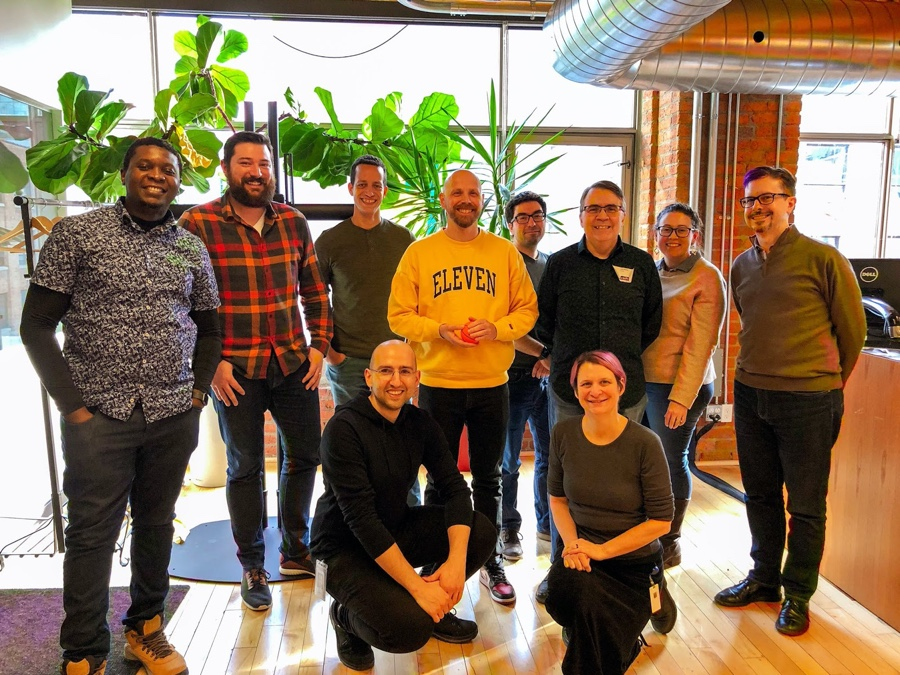

# MDN Product Advisory Board F2F Meeting, February 2020

Attendees: Daniel Appelquist (Samsung), Jory Burson (Bocoup), Kyle Pfug (Microsoft), Dominique Hazael-Massieux (W3C), Joe Medley (Google), Chris Mills (Mozilla, remote), Robert Nyman (Google), Ali Spivak (Mozilla), Kadir Topal (Mozilla).

In-person guests: Peter Chinaka (Mozilla), Mustafa Al-Qinneh (Mozilla)

## Logistics
* Date/Time: February 10-11, 2020
* Location: Mozilla Toronto office, 366 Adelaide St W., Suite 500, Toronto, ON M5V 1R9, Canada 

## Monday, February 10

* 9:00 Arrive at the Mozilla office & breakfast
* 9:15 Welcome & Orientation [30 min]    
* 9:30 Review Action items from the [June 2019 meeting](2019-06-notes.md)
* 10:00 2019 Review
  * Content
  * Platform
* 11:40 Lunch
* 13:00 MDN 2020 planning
* 15:15 MDN DNA
  * 2019
  * 2020    
* 16:00 Events / TPAC
  * TPAC2020 Vancouver:
    * Training sessions
    * Meetup?
    * Plenary/Breakouts?
    * Hackathon?

## Tuesday, February 11

* 9:00 Arrive at the Mozilla office & breakfast
* 9:30 Sort out topics for today
* 10:00 New PAB member guidelines
* 10:30 MDN and Frameworks
* 11:00 BCD data discussion w/ Ada & florian
  * How big should MDN PR’s be, optimally.
  * Should we create a guide?
* 11:15 Treating IDL as if it is JavaScript.
* 11:30 Content on MDN
  * Help with bandwidth
  * What to work on
* 12:30 Lunch
* 13:00 Discuss concrete actions based on DNA survey
  * Interoperability
  * Drive and then promote more web platform wins?
* 16:00 Review Action items
* 16:30 Plan next meetings
  * Quarterly call
  * Face to face

## Action items

* ACTION: [Ali & Dan, with Chris]: Set up PWA task force to make sure we deliver concrete results. Set up a call to kickoff & set up a workable process.
* ACTION: [Joe] Add update from Joe on content priorities from Google to the next quarterly meeting 
* ACTION: [Chris & Kadir] Make sure keeping info on W3C specs up to date on MDN is added into the discussion of Stumptown plan
* ACTION Dan Fernadez at Microsoft - can [Kyle] connect w/ Kadir?
* ACTION [Kyle] follow up with Chris on Web Authentication docs
* ACTION: Dom to Introduce  Aftab Allam to Chris
* ACTION: Joe will set up conversation w/ Elizabeth Sweeny & MDN
* ACTION: Robert happy to connect MDN folks with Learnjavascript if you want to discuss learnings, approaches etc
* ACTION: [Kadir] Can we get stats on searches for Web API’s that they are not finding as a means to prioritize which API's to document?
* ACTION: Kadir to Start producing overall traffic reports on a regular cadence
* ACTION: [Kadir] Write a blog post, etc celebrating MDN traffic increases and the data/improvements behind them.
* ACTION: [Kadir] Include PAB members in 1st wave of MDN subscription rollout
* ACTION: [Ali] PAB members (Dan & Kyle) to look at wording & communications around subscriptions to hep vet for community sensibilities
* ACTION: [Kadir] Deeper dive into risks of moving to Github. Specifically pull request backlog gets out of hand. Policies, etc. If don;t have time, we should do a separate meeting w/ MDN team on this topic.  
* ACTION: [Kadir, Ali] Prep & send out MDN DNA sponsorship packet ASAP
* ACTION: [ Kadir, Kyle, Robert] Follow up to see if there is an opportunity to involve user researchers from PAB members.
* ACTION: Dom to go back to W3C to see what is possible for event around TPAC. Check with committee chairs, etc around timing,. 
* ACTION: [ali & dan] Set up PWA task force w/ a series of checkpoints, like weekly meetings
* ACTION: Dan will schedule a call to discuss PWA next steps
* ACTION: Ali will create a doc to list potential PAB candidates that meet criteria; final conversation at the next quarterly call. 
* ACTION: Chris will share the first frameworks documentation for review
* ACTION: Kyle will provide a BCD contact on the Microsoft side
* ACTION: Kadir to follow up with Apple on BCD
* ACTION: Jory will help find a contact for NodeJS
* ACTION: [Jory] Biweekly JSFoundation working group meeting, that group could help make contact with [kangax](https://github.com/kangax). Jory will bring up.
* ACTION: [Jory] Work with Chris/Kadir to submit MDN talk to OpenJS Conference in June 
* ACTION: Joe will go through IDL spec and note things that should not be on MDN
* ACTION: [Chris] Explore making flagging of IDLisms part of the linting 
* ACTION: [Everyone, Joe] Send in ideas to simplify MDN docs and remove things that should not be used anymore.
* ACTION: [Chris] A template for how to contribute a new feature page
* ACTION: [Ali, Chris] Process to get developer-on-the-street input, prioritize, and make specific asks around those topics.
* ACTION: [Chris, Joe] Create users stories for pages to be written with acceptance criteria and todos
* ACTION: [Ali, Chris, Joe] What should we consider as inputs / signals for prioritization.
* ACTION: Chris or another member of MDN content team submit a talk to OpenJS conference to talk about the connection to the content on MDN and the DNA, plan for the future of MDN (stumptown, etc)
* ACTION: [Ali] Follow up on content prioritization at the next PAB quarterly meeting
* ACTION: Kadir to follow up on how to and whether to add polyfillability to MDN BCD data
* ACTION: [ali] Blog post about PAB outcomes from this meeting
* ACTION: Kadir to Check out https://gitlocalize.com/itlocalize
* ACTION: [Kadir, Robert] Field MDN DNA Follow-Up Surveys
* ACTION: [Ali, kadir] look into turning mdn.dev into a place for MDN updates. 
* ACTION: [Ali]  Send email seeing if 1st week of August in Stockholm would work. 
* ACTION: Schedule quarterly call for end of April, week of 27th. Check days and time w/ PAB. Do a doodle. 
* ACTION: Kadir schedule a call to discuss DNA once we confirm funding.
* ACTION: Kadir to share schedule for new DNA survey
* ACTION:  Ali write up a principal document for MDN, explaining neutrality, etc. 

## Postponed Agenda Topics
* Discuss what constitutes the Web Platform re: MDN content, what to document and what not. Lack of consistency. (joe)
* Web Authentication (Dom)
* Accessibility Testing / ARIA  (Jory)
* Compat audit into Lighthouse?
* Per page ROI, how to decide prioritization
* Removing proprietary IE Javascript documentation
* Github Exit strategy??  Also how to publicly talk about it. 

## Meeting Notes

### June action item review

#### Completed

* Drop Edge mobile from the table rendering on MDN and maybe also from the data? ([related issue](https://github.com/mdn/browser-compat-data/issues/3888)) 
* See if there is interest in a Developer needs survey results talk at TPAC 2019, also a breakout session soliciting participation from W3C community. 
* Share info on State of the Web dashboards for India, Indonesia and Japan w/ PAB members (Robert)
* Content collaborations/partnerships - Open JS Summit following up on conversations from collab summit & other ideas (Chris)
* Meeting with Google & Mozilla about learning from migrating docs to GitHub (Ali, Meggin) ([related issue](https://github.com/mdn/pab/issues/37)) 
* Connect Kadir w/ Sebastian on React (Robert)
  * Sebastian connected Kadir with Dan Abramov
  * Review by Estelle Weyl before launch
* Create a description & goals of conversation areas at View Source (Ali)
* Put together a GTM template & short description of the developer needs survey for partners (blog template description of survey, methodology, who has contributed, how it could be used) (Kadir)

#### In progress

* Update how Edge is referenced in web compat tables (Kadir) ([related issue](https://github.com/mdn/browser-compat-data/issues/3705))
  * There is a pull request that needs to be reviewed
  * Only shows one Edge, jumps to 79 and starts giving information about new Chromium-based Edge.  
  * A few things were available in old Edge that are not in the new 
  * Kadir will follow up with Kyle to see if we can get a review of the pull request by Microsoft team
* Look into doing a combo View Source/TPAC event in 2020 (Ali, to discuss later on in this meeting) 
* Follow up on framework documentation on MDN (Chris)

#### Needs restarting

* PWA documentation: still needs to happen, will discuss later in this meeting. 
  * ACTION: Form a team & figure out "f2f" working session on PWAs (Dan & Ali - discuss this again as part of PWA discussion)
* Update the experimental spec warning banner to ask for feedback on the spec (Chris, did not happen) ([related issue](https://github.com/mdn/pab/issues/58)) 
  * Got lost in discussions about next-gen MDN, decided to wait until the project to do this. 
  * ACTION: Re-open this discussion as part of Stumptown discussions (Chris)
* Keep info on W3C specs up to date on MDN (Dom) ([related issue](https://github.com/mdn/pab/issues/19))
  * Yes, it would be good to move forward on this.
  * Next steps: Come up with a plan if it is agreed upon.  
  * Plan was done, but not implemented
  * This seems to have fizzled out, need to revisit as part of Stumptown work
  * ACTION: Make sure keeping info on W3C specs up to date on MDN is added into the discussion of Stumptown plan (Chris,  Kadir)
* Follow up w/ Kyle on some possible help with Web Authentication doc overhaul (Chris)
  * ACTION Kyle to follow up with Chris on Web Authentication docs
  * Dom working with Masters’ student on this topics, he’s planning a survey on this topic but having trouble recruiting participants. Maybe could work together on this. Could use a better tutorial on this on MDN 
  * ACTION: Dom to Introduce  Aftab Allam to Chris
* Updating MDN spec tables [Chris & Dom]
  * This is related to the action item above, need to revisit implementing
* Help Kadir w/ connections to the Lighthouse team. Re: browser compatibility audits ([related issue](https://github.com/GoogleChrome/lighthouse/issues/4377))
  * ACTION: Joe will set up conversation w/ Elizabeth Sweeny & MDN
* Work on guidelines for supplemental/membership content on MDN web docs, curation, etc. (Ali)
  * ACTION: Still needs writing, to explain neutrality, etc. 

#### Not doing

* Share the MDN Beta performance numbers with React with PAB members (Kadir)
  * MDN performance on React is identical to the non-react version
* Figure out what the default set of browsers should be for MDN customization (Kadir) 
  * This work is deprioritized
* Consider using customization w/ framework set (Kadir)
  * This work is deprioritized

### 2019 MDN review
(Chris and Kadir)

#### Content

* 2019 saw us working on Firefox 65–71.
    * [CSS Houdini](https://developer.mozilla.org/en-US/docs/Web/Houdini)
    * [WebXR Device API](https://developer.mozilla.org/en-US/docs/Web/API/WebXR_Device_API) 
    * [Media format guide](https://developer.mozilla.org/en-US/docs/Web/Media/Formats)
    * Numerous [WebRTC](https://developer.mozilla.org/en-US/docs/Web/API/WebRTC_API) updates 
    * Updates to our [RegExp reference](https://wiki.developer.mozilla.org/en-US/docs/Web/JavaScript/Reference/Global_Objects/RegExp) 
    * CSS features like subgrid, text underline properties, individual transform properties, logical properties, shadow parts, scroll snap, motion path, new MQs like prefers-color-scheme, prefers-reduced-motion
    * JavaScript stuff like BigInt, numeric separators, nullish coalescing operator, public class fields, dynamic module imports
    * New APIs like resize observer. Visual viewport. 
* Learning area:
  * [Web forms reboot](https://developer.mozilla.org/en-US/docs/Learn/Forms)
  * [Front-end web developer learning pathway](https://developer.mozilla.org/en-US/docs/Learn/Front-end_web_developer) 
  * New “test your skills” articles being written, for example:
    * [Conditionals skill tests](https://developer.mozilla.org/en-US/docs/Learn/JavaScript/Building_blocks/Test_your_skills:_Conditionals) 
    * [Flexbox skill tests](https://developer.mozilla.org/en-US/docs/Learn/CSS/CSS_layout/Flexbox_skills) 
  * Progress being made on tools and client-side frameworks (authors working on material)
  * [Web performance]( https://wiki.developer.mozilla.org/en-US/docs/Learn/Performance) progress (still needs a bunch of work) 
* Lots of dev tools + WebExt docs updates
* Documented privacy-improving platform behavior changes, like anti-autoplaying audio, and anti-notification spam
* BCD data “complete”, and on to improving quality.
  * We got to 100% real CSS values
  * We got 100% real JS values
  * Implemented a governance model.
  * We also integrated communities with caniuse.com, and MDN data is now being shown on caniuse.
  * Note: Prepping update from Samsung, during the last one there were some questions on the size of the PR’s, as there was one big PR submitted. 
    * Maybe Ada & Florian could collaborate on a guide. 
    * Note: Have a follow up conversation on this later in the meeting
  * What happens during the PR review? Is there a test protocol or process for MDN? Usually the compat data PR is checked against the changelog  
* Content team also spent some time working on the next gen of MDN (see [stumptown-content](https://github.com/mdn/stumptown-content))
  * Readable markup format, much simpler platform than Kuma. No KumaScript
  * HTML page structures worked out
  * JS page structured worked out
  * Common feature representation worked out, e.g. live examples, sidebars

#### Platform

* MDN traffic in 2019
  * 10% y/y growth
    * Lots of seasonality
  * Massive growth in China and international
    * China was ~40% y/y traffic growth 
    * Don’t have a lot of visibility from Baidu, more difficult to get info because it’s not available in English. 
    * Would be interesting to understand the intersection of mini apps and web.
  * Small growth in US
    * Up until the end of the year, US traffic was down 5%
      * New competitor (geeks for geeks)
      * Mobile first indexing for search problematic for MDN, not optimized for mobile. Currently 95% of traffic comes from desktop. Mobile version is not good. Might be a chicken and egg problem, they don't use mobile because it;s bad, not that they don’t want to use it.
      * Something we need to explore for 2020
      * Definition lists vs. tables for search result priority?
  * Learnjavascript online uses flash cards on mobile, something like this could be a good option for MDN to do something similar
    * ACTION: Robert happy to connect you if you want to discuss learnings, approaches etc
  * Javascript ~40% of MDN traffic, WebAPi’s 14%
    * ACTION: Can we get stats on searches for Web API’s that they are not finding as a means to prioritize which API's to document?
    * ACTION: Start producing overall traffic reports on a regular schedule, look at slices to see what is most interesting (Kadir).
    * 75% of traffic to Web API docs goes to ~400 pages
    * Fetch gets the most traffic by far
    * Page title changes that removed technology had massive (bad) impact, did more experiments to understand what else might have good impacts - no change. So, don’t take technology out…
    * Bounce rate? High bounce rate in the case of MDN might not be bad, often means they found what they are looking for. Task completion survey says 85% of people got the information they were looking for. 
    * For reference articles this makes sense, not so much for the learning area where you want people to go through sections. 
    * Also, if you point people to more learning content from the reference material it would change the rate…
    * Can track what snippets show up in search (MDN vs. others)
    * Changes to breadcrumb design correlated to increased US traffic at the end of the year.
    * ACTION: Write a blog post, etc., celebrating this!
* Prepared MDN for logged in users
  * Logged in performance was significantly worse then not + database hits would slow down the entire site for all users.
  * Discussion about React in the community sparked a better development + review process. 
  * Switch to react in October
  * New architecture (wiki/read-only)
    * Today you essentially have 2 versions, 
    * One is the logged out version - the read-only React version (for most users) 
    * 2nd is the wiki, which is the old architecture and only should be used for content writing.
    * This means whatever changes you make on the public version are not reflected in the wiki version. 
    * Not optimal, it’s a stopgap that we will address in 2020.
    * Note, the wiki doesn’t redirect non-logged in users to the public version.
    * MDN is CPU bound 
  * Updated log in flow
    * Google auth
* Payment on MDN
  * Scrapped integration with Mozilla subscription service.
  * New integration with Stripe
* Compat data Banner
* Operational necessities
* Platform experiments

### 2020 plan
(Chris and Kadir)

#### Context setting for 2020
* Mozilla restructured: people were laid off (outside of MDN).
* Broadly, both headcount & program funding were reduced & as a result MDN has to be tightly focused.
* MDN was prioritized, but due to budget cuts we sre restricted in what we can do
* MDN content has been scoped back, platform shift is getting major funding
* Two core priorities for 2020 are using subscriptions to build a revenue stream and enabling a platform shift so we can do more with less investment and technical debt.

#### 2020 Content
* Lots of Firefox releases to cover this year (now we are on a 4-week release cycle)
  * New CSS, JS, DevTools, WebExt, etc. features
* Learning area
  * Finish off tooling and frameworks docs, and get feedback to inform our next move in this area.
  * Finish off FED learning pathway, 
  * Finish off “test your skills” pages.
  * Finish off WebXR device API
  * Update WebAssembly docs
  * Improve security docs
* BCD
  * Finish off 100% real JS values
  * Work on plan for next data quality improvement step, maybe something like “100% values for the API pages that provide 80% of WebAPI page traffic on MDN”
  * Also working on an update for Edge support in light of the new Chromium-based release
  * Also set to perform an update in light of the upcoming Fenix-based Fx mobile release.
* Moving contribution workflow to Github
  * We’ll keep most of the architecture intact and off load contribution to github
  * Deleting 80-90% of the current MDN Kuma code.
  * Currently working on implementation plan for that
  * Next step: structured content leading to a further simplification of architecture and easier contribution.

#### MDN 2020 platform OKRs

* 5% growth
  * 5% seems low - keeping up with Market expansion, won’t have resources to invest in larger growth tactics (content, SEO, etc.)
  * Does Mozilla do OKR’s like Google, where you set very stretchy goals and look at achieving a significant percentage of them as success? Mozilla mostly looks to achieve at 100% on yearly KR’s. 
  * Looking at the ROI of page creation, the cost of writing is the same but the value of each page is not the same. Focus on the highest user value content.
  * Look at cost of per-dictionary page
    * E.g. Treating IDL as if it is Javascript.
* Yari (changing the contribution platform & workflow)
  * Yari 1 - move content & content writing to GitHub
  * Yari 2: move away from proprietary static site generator 
* Stumptown in 2020 (content migration + shift to structured content)
  * Working on getting the MDN docs we care about the most ready to move over to GitHub.
  * At the moment, this means working on our KumaScript macro “render, remove, replace” plan.
  * Then the dev team will look to move the docs over to GitHub and serve them from there instead.
    * Also need to figure out what the contribution workflow will look like 
    * Exit strategy also important
  * We will then carry on working on page structures for all the docs we want to represent in the new system.
  * We are also in discussion about what to do about non-en-US locales. Loosely put, we will do some research to figure out what locales/pages have a lot of traffic, keep those, delete the rest. Keep the ones that are looked at a lot in the short term, then for the future treat each one as a separate project entirely, with proper funding, etc., if we are going to make a go of it.
    * Initial research suggests that we should probably do auto translation of all the content, and then get it cleaned up by a human.
* Launching MDN Subscriptions
  * ACTION: Include PAB members in 1st wave of MDN subscription rollout
  * Adding Google auth for accounts in addition to GitHub. 
  * Can delete own accounts now as well. 
  * MVP - not localized, USD only, credit card only. 
  * Will add additional options as we go on (e.g. WePay, etc.) 
  * ACTION: PAB members (Dan & Kyle) to look at wording & communications around subscriptions to hep vet for community sensibilities
  * In 2019, ran tests on HTML area  for structured content since it is the most compact. Not planning on starting with HTML for 2020 - not starting with structured data so kinda moot point.
  * Will do a full platform switchover when it happens, for all content to the new platform. Will not go area by area. 
  * ACTION: Deeper dive into risks. Specifically pull request backlog gets out of hand. Policies, etc. If don;t have time, we should do a separate meeting w/ MDN team on this topic. 

### MDN DNA survey 2020

(see here for [2019 review](https://docs.google.com/presentation/d/1JdpeyuNvJa-d5U_YrZGy6xwFzWAqjF3bjlRP0KW6sug/edit#slide=id.g62bd0dd413_0_188))

* Funding - cannot be funded by MozillaDevRel team in 2020. Looking for sponsors (including inside Mozilla).
* Scope - largest survey of web developers conducted so far (28k)
* Resources, as in people.
* Increasing the diversity of respondents
  * Poor gender balance, not representative of industry as a whole. 
  * Preponderance of respondents were MDN users.
  * Possible to do more sustained outreach to non-MDN users 
  * Do something similar to what Stack overflow does, statistically project what gender balance would look like
* Next time, need to do a better job coordinating efforts
* Key input: Needs to be more clear about what should be done about/with this information One thing that would be valuable is more input on what browser vendors are doing to address issues. 
* ACTION: Make sure to call out what actions were taken based on the 1st edition.
Things that would help drive funding from PAB members
  * Include access to follow up research (fairly open to the form this would take)
  * Recruit small pool of respondents to more direct private feedback w/ funders (e.g. review prototypes). 
  * Acknowledging funding and what it means, plus data and other practices.
  * People indicated they want browser vendors to hear them. 
* ACTION: Prep sponsorship packet ASAP
* Is there an opportunity to involve user researchers from PAB members to save $? ACTION: Follow up on this.

### Events

* Maybe add it to TPAC?
* Maybe allow larger public to attend?
* Maybe some talks and some interactive sessions
* Support from PAB folks
* Next Steps, go back to W3C to see what is possible,
* Check with committee chairs, etc., around timing.

### PWA documentation chat

* Sheppy was working on PWA docs but did not get enough feedback on planning for docs
* There might have been a disconnect, not everyone remembers that there was outreach. 
* Next steps to (finally) move this forward: 
  * (Dan) Set up a specific call to discuss next steps
  * (Ali) Will drive that process to conclusion
  * Dan suggests a series of checkpoints, like weekly meetings
  * Dan will assign people to this work; suggests Laura, who has written about PWAs in the past

### New PAB member guidelines

* If we invite someone, they (and the public) will understand why they were invited & understand the direction they can provide to the PAB. 
* Problems to solve:
  * Increase diversity of the PAB
    * Gender, geographic, view point/career
    * People who are not embedded in companies, more independent
    * South America and Asia are currently not represented
  * Increase credibility of the board
  * Better understand needs of a certain region
  * Expand what the board can get done in a year
* Should we consider Invited experts instead of permanent members (assuming we cover their expenses)? * Decided not to do this at this time. 
* Profile: 
  * People working directly with (web) developers 
  * Could be developer advocates as part of their roles, real world development
  * Some involvement in standards
  * Some background with MDN
  * Community leader
* Expectations
  * Bring real-world community perspective / community advocacy (non-browser perspective)
* Questions:
  * How many people would we add?
    * Maybe two
  * What’s the timeline
    * 1-2 months
* ACTION: Ali will create a doc to list potential candidates, final conversation at the next quarterly call

### MDN and Frameworks

[Chris's writeup of the subject](https://github.com/chrisdavidmills/mdn-and-frameworks/)

* We’ll get accusations of bias, but people are mostly excited about frameworks getting more exposure
* Framework vendors like the idea, because they can’t be as opinionated about choices
* Trying to strike a balance, being useful without getting too much into the weeds
  * When and when not to use frameworks, etc
* We might have to review framework docs every 6 month or so
* Want to follow up with research once the first version is shipped
* Questions: 
  * Any interest on the framework side to contribute resources or audit what’s there? Should MDN only have intro docs?
    * Yes, intro docs only for now
    * Yes, trying to get interested parties to review regularly
  * What are the criteria to add frameworks to MDN?
    * 5 chosen: established and smaller ones that are getting traction
      * Angular, Vue, React, Svelte , Ember
    * There are not crisp guidelines at this point, but we could add that and invite frameworks to add themselves to MDN that satisfy those guidelines
  * Who would own the framework documentation?
    * Depends on where it comes from. MDN would own the work that we commissioned
    * Community might own docs that are contributed.
  How will things be decommissioned?
    * Team will decide on archiving
  * The Web DNA hints that there are issues that we might want to address
    * How to handle more than one framework in one code base
    * Ever Changing landscape
    * Documentation of frameworks and libraries
* ACTION: Chris will share the first frameworks documentation that comes in

### BCD discussion with Ada and Florian
* Question:
  * What’s the current state of the for updating bcd?
    * Breaking up content areas
    * Smaller PRs are better
    * Should be part of the routine in coordination with a browser release
* Maybe we should update the guide on MDN about updating BCD
* Florian would like to have access to browser vendors, specific contacts
* Action: Kyle will provide a contact on the Microsoft side
* Action: Kadir to follow up with Apple
* Action: Jory will help find a contact for NodeJS
* Biweekly JSFoundation working group meeting, that group could help make contact with kangax.
* Might make sense to have a regularly scheduled monthly meeting or something to keep people reminded of the work. Have monthly call with caniuse, could expand...

### Treating IDL as if it is Javascript
* Is it useful to developers to reflect wording in the IDL?
  * No, we should keep a list of “things to simplify MDN”, this would be one of them
* ACTION: Joe will go through IDL spec and note things that should not be on MDN
* Dom suggests making that part of the linting
* Chris asking everyone to send in ideas to simplify MDN docs and remove things that should not be used anymore.

### Content on MDN - help with bandwidth & what to work on
Context: MDN has a lower budget in 2020 compared to 2019, we can’t bring in as many content writers as last year. What can we do and what should we prioritize?

* It would be helpful to have data on what’s missing on MDN that’s popular
* JSF might be able to corral developers to contribute to MDN. 
* Engineers who build a feature need to make sure the feature is documented, but currently with the way MDN works having engineers do that would add more work than it solves
* Request for a good template for how to contribute a new feature page + guidelines on how an API overview page should always be added
* This should get easier with Stumptown
* Microsoft’s approach is generally for engineers/PMs implementing the feature to own documenting the feature. Working on staffing up a content team to increase contributions to MDN & improve quality/quantity of docs generally, but no clear timeline at this point
* Discussed:  MDN team should consider prioritizing what gets documented outside of just doing  everything in each browser release. Helpful to have some mechanism about community priorities outside of (browser vendor) business priorities.
* ACTION for Chis: Maybe we can create user stories for pages to be written with acceptance criteria and todos
* ACTION: Work out what we should consider for inputs / signals for prioritization ideas?
* Would be great to have Chris or another member of MDN content team submit a talk to OpenJS conference to talk about the connection to he content on MDN and the DNA, plan for the future of MDN (stumptown, etc)
* ACTION: Add follow up to quarterly meeting

### Discuss concrete actions based on DNA survey as far as interoperability, to drive and then promote more web platform wins?

Context from Robert: with the outcome of the survey, there is an interest to address these issues. Next is presenting ideas to address them. Philip Jägenstedt from Google (not present) and Robert are interested in addressing interop.

 * Robert: should we talk about things that are not about MDN?
* Dan: Things that are not on MDN yet, but could be should be the scope
* Jory: what do we as implementers do about these items, what do developers do.

Addressing top needs on MDN. Discuss joint efforts around these:

* Browser Compatibility
    * Problem 1: Having to support specific browsers (e.g., IE11).
      * Is there something on MDN to help people who have to target IE11 or similar browsers?
      * Document graceful degradation / progressive enhancement / fallbackback approaches (polyfillability?)
      * Maybe we should add editorial content about letting go of IE11? Microsoft would be interested in reducing the usage of IE. 
      * It can help to have a page that devs can point to resources: like docs that show a countdown for IE obsolescenes.
      * Docs on best practices/supporting data about how to handle legacy browsers for agency/client work
       * “MDN as a resource to help empower developers.” - Robert
      * Google is doing a followup survey in the next couple of weeks to do a deeper dive into interoperability issues. Chrome leadership cares about this. 
      * Polyfillability is a thing we care about during standardization processes. Web XR is an example for that.
      * MDN could offer polyfillability (or with css, @supports?)  data as part of the BCD
      * ACTION: Kadir to follow up on how to and whether to add polyfillability to MDN BCD data
    * Problem 3: Avoiding or removing a feature that doesn’t work across browsers.
      * Assuming it’s about how to deal with lacking support:
      * Creating a section on MDN about Progressive Enhancement, paired with information and data to empower developers
      * Teaching about polyfills
      * When it comes to a report:
          * Question: more for JS or CSS, any specific area? 
    * Problem 5: Making a design look/work the same across browsers.
      * Do we have content on MDN about this?
          * We have a layout cookbook that talks about fall backs.
      * Research: what is the most common issue you have when it comes to interop?
      * How do we make people aware how to address these pain points?
          * A document on MDN that talks about how you can address these pain points? (`you remember the survey? Here’s what we did to follow up’)
    * Problem 18: Knowing what browsers support a specific technology.
      * Promoting BCD
      * BCD integration in VS Code, and [webhint.io](https://webhint.io/)
      * Explore browser tooling and data licensing  / liability disclaimer
*  Frameworks
    * We need research on what problems developers are solving with frameworks & their toolchains?
    * Is this more about frameworks or more about tools?
    * How much are browsers creating the need for frameworks?
    * Problem 2: Outdated or inaccurate documentation for frameworks and libraries.
      * Can we inspire change on best practices for documentation?
      * Maybe beyond the scope of MDN?
      * Maybe we take this to “write the docs”  and show them that this is a problem.
      * Maybe nudges on Github about docs when you use server and increment versions.
      * Maybe getting to root causes is a good next step.
    * Problem 7: Supporting multiple frameworks in the same code base.
      * Could be tackled as part of the framework documentation effort on MDN
    * Problem 8: Keeping up with a large number of new and existing tools or frameworks.
      * Maybe grouping them would be helpful
* Testing
  * Question: when are they testing
  * Problem 4: Testing across browsers
    * Is this about automated testing?
    * We’ll follow up with a survey
      * [MDN DNA Follow-Up Surveys](https://docs.google.com/document/d/1cFIRNNmWUUE1b6Pp8ReBM8yv34_KaknnxAvZ3IzmRJ8/edit#heading=h.i86vc3xzl3qc)
  * Problem 12: Pinpointing existing performance issues
    * How much is in page performance vs loading performance?
    * Is this a debugging problem?
    * There is a fragmentation in how we address developer needs
    * What’s the motivation for solving performance problems? Maybe that can be an angle use.
  * Problem 13: Running end-to-end tests
  * Problem 20: Running front-end tests

* Documentation
  * Problem 2: Outdated or inaccurate documentation for frameworks and libraries.
  * Problem 15: Outdated documentation for HTML, CSS and JavaScript.
    * Strong language bias => localization effort?
    * Is there a breakdown of which locales are most unsatisfied?
    * We should look into [gitlocalize.com](https://gitlocalize.com/)
   *  Removing L10n is not a good option
    * Question: what is the migration plan?
    * Question: What is the investment necessary to migrate localized content
    * Q: Can we apply for grants for some of this
    * Criteria for inclusion: the capability of the community to review (maybe a minimum number of people)
    * Maybe auto translate for pr reviews?
    * Maybe no l10n capabilities in the short term 
  * Problem 22: Keeping up with changes to the web platform.
    * Maybe latest browser release
    * Maybe latest top 10 platform features
    * Use HTTP Archive 
    * Maybe messaging about web platform features that have reached the threshold of availability
      * When a feature has support in more than one engine/browser
* Debugging
  * Problem 6: Discovering bugs not caught during testing.
  * Problem 12: Pinpointing existing performance issues.
  * Problem 16: Determining the root cause of a bug.
Privacy & Security
  * Problem 9: Managing user data to comply with laws and regulations.
    * This will be a narrative on the Mozilla dev rel side
  * Problem 10: Understanding and implementing security measures.
    * MDN is preparing documentation of best practices and work with Observatory on this.

* Would be helpful to see consistency & correlation between these, grouping. 
* Would be good to have a plan to address the issues
* What about a cadence? We publish blog posts maybe 6 month after results are published? In April we should be able to say: we told you this survey would lead to change: Here’s that change. Robert: To show that things are getting better on the web.
* Maybe something like a marketing campaign?
* Should we maybe document privacy features in browsers. Tracking protection comes to mind?

## Next Meeting
Constraints:

* June 15-19 Mozilla all hands
* June 22- 26 JS Foundation events 
* TAG September meeting is in Ireland. December is Seattle.

Aim for 1st week of August? Have folks confirm if this will work. 

Stockholm would be best for Robert.

Proposals: 

* Location: Sweden
* Could host in Mozilla Taipei, maybe make that the winter meeting?
