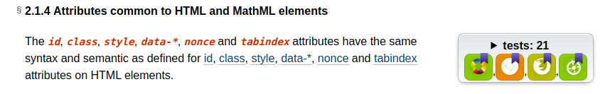

# MDN Product Advisory Board video meeting, January 2021

Attendees: Reeza Ali (Microsoft), Dan Appelquist (Samsung), Sukriti Chadha (independant), Daniel Ehrenberg (Igalia), Dominique Hazael-Massieux (W3C), Brian Kardell (Igalia), Chris Mills (Mozilla, Chair), Sheila Moussavi (Bocoup), Robert Nyman (Google), Kyle Pflug (Microsoft), Ali Spivak (independant)

## Logistics
* Date/Time: January 27 2021, 09.00 Pacific / 17.00 UK time / 18:00 Europe
* Location: Mozilla Zoom room

## Agenda

1. Intro round
1. Updates on action items from last time
   1. [DONE] ACTION: Chris to share Yari post with PAB folks.
   1. ACTION: Chris to brainstorm with Dom using github to simplify spec/docs workflow integration.- ACTION needs to be followed up on; see https://github.com/mdn/pab/issues/81 for further activity
   1. ACTION: Chris/Florian to create process for bringing documentation of new features in MDN docs. Started: Proposal for MDN content collaboration
   1. Work out process and benefits text for PAB memberships: https://github.com/mdn/pab/issues/80
1. (Dom) RFCs for MDN
1. (Chris) Updates from Mozilla
1. (Robert) Short surveys on MDN
1. (Dom) Following on from previous point — Web DNA 2021
1. (Robert) Improving BCD presentation on MDN
   1. Traffic lights?
   1. Can I use integration?

## Meeting notes

### RFCs for MDN

(Dom, proposed initially by Florian) having a (not necessarily formal, but documented) process to discuss platform evolution would be a useful addition to the MDN community.

Getting inspiration from the RFC approach that have been successfully used in several communities (python, PHP, Rust to name a few) would allow us to bring iterative feedback and community momentum on these changes.

With the transition to Yari, I believe a lot of questions on how content is tagged, organized, structured will emerge — right now, I'm assuming they would be discussed as part of the editorial meetings, but I think giving them more visibility and giving more agency to the broader community would be beneficial to MDN.

Thinking aloud on the topics these RFCs could be applied to:
* "moving off HTML"
* documenting interface mixins
* localization strategies

For a non-trivial change, write up a public spec that people can then comment on.

So we need a template, guidelines, a process, and a location to put it all.

ACTION: Write up proposal for RFCs, including template and process (steal)
Assigned to Dom, also Florian could perhaps help.

### Updates from Mozilla

News: Adam (COO) is leaving Jan 31. Shared last week as well.
Responsible for product focused approach and OWD conversation
MDN now within Mozilla’s marketing org
Not much more communication about next steps yet. More to follow when we get it.

### Short surveys on MDN

We’ve been doing Web DNA for a couple of years; interesting to get high-level pain points info.

Last year’s survey reaffirmed this, however the major pain points didn’t change much, and probably won’t change much if we do the same kind of survey next year..

Instead we’d like to propose shorter surveys, more often.

* Use MDN task completion survey to give people surveys to fill in
* Instead of 25 minute surveys, do a 2 minute survey once a month, on more specific topics, e.g. CSS layout.
* Smaller surveys, much quicker turnaround.
* Also costs less to run

Discussed so far at google (Robert/foolip) and Mozilla (Chris/Hermina). Thoughts?

Sukriti — do we have implicit metrics/understanding to help bolster results, and do we have real time feedback?

Robert — WebDNA not about MDN as such, more about web problems in general (e.g. compat). MDN as diverse as possible, neutral, etc.

Dom — supports this, distinguishing between short surveys and longer surveys, and things that can and can’t be captured by these approaches

Sheila — things like demographic data are hard to catch through short surveys

Robert — also need to be really careful that we are clear on PII/privacy policy for both types of survey. Make sure we have clear process and definition for designing questions, what PII is needed, what we can ask with PII

Reeza — how will developers feel about this? Might get annoyed. Need to allow people to opt out.

Robert — yes, probably need to build in mechanisms to protect people from survey fatigue. Also, different surveys could be rolled out to different percentages of MDN users, and just in different areas, depending on focus and importance. In the future we could even reward people for doing the surveys, in some way.

Brian — could we make something fairly inconspicuous that is there all the time, then a random sampling of % gets something more prominent at times? Maybe if so it would be good to track which of those two it was as you can expect that the people who do the inconspicuous one is maybe/probably a different kind of involvement.

Sukriti thoughts on this; we need to:

* Allow developers to easily dismiss the prompt
* Position it as an opportunity to give feedback

* Provide an upper bound on time/ developer spent on surveys

ACTION: Robert/Chris to work more on survey framework, process, make sure it gets PII built in!

### Web DNA 2021

Web DNA 2020 was rushed, and impacted by Mozilla layoffs

Should come up with plan for this year

Funding is a big thing. Microsoft/Google to fund this again?

Kyle — might propose decreasing frequency in current form, 2, 3, 5, years?

Smaller surveys could have much sharper focus on finding immediate problems.

if there isn't a DNA 21, we should also let the community know

ACTION: Wait for above action to be completed, then work out what DNA should do , how it should stand alongside short surveys

### Improving BCD presentation on MDN

MDN compat data tables used to be hand-maintained, but the data is now in its own repo.

Yari now in GH repo as well.

Lots of data there now, but there is still a lot of work to be done here.
We need more information about how useful BCD actually is. Is it as useful to MDN readers as it could be? How much is it being used in tools?

Part of this is a discussion on improving presentation. To make it easier, could we use a traffic lights system?

And/or could we just use the caniuse presentation actually on MDN?

Joe — caniuse data; exactly what do we have in mind there?
Caniuse is using BCD data for a lot of its tables now.
Single point of failure (caniuse is just one man)
Yes, would have to mitigate, if MDN goes down this path.

Chris — we also talked about BCD ribbon on top of page for a while

Dom — UX research? Yes!

Chris - we are hiring a UX/designer at the moment

Brian — in previous minutes, people brought up challenges like methods or properties being experimental. Having this granularity, versus just a traffic light… Existing specs do a some interesting flagging like this:

Chris - yes, granularity, simplified versus complex views? Maybe even an automated code compat tester based on trawling BCD?

Reeza — how about automated testing of data?

Robert — perhaps using WPT in the future? But not really right now.

Would it be good to discuss what users do in terms of using the data? Research testing

Joe — follow on from Brian’s point.  People often assume that the overall spec data is all they need to know, whereas in fact that this is not the case. Need some kind of summary for a spec (or an interface) that explicitly points out where the outliers are, if any.

ACTION: Need to come up with a plan for better BCD presentation, and share it around for comment.

### Action items

* ACTION (Dom, Florian): Write up proposal for RFCs, including template and process to use ([issue #82](https://github.com/mdn/pab/issues/82))
* ACTION (Robert/Chris): To work more on survey framework, process, make sure it gets PII built in! ([issue #83](https://github.com/mdn/pab/issues/83))
* ACTION: Wait for above action to be completed, then work out what DNA should do next time around, and how it should stand alongside short surveys ([issue #84](https://github.com/mdn/pab/issues/84))
* ACTION: Need to come up with a plan for better BCD presentation, and share it around for comment. ([issue #85](https://github.com/mdn/pab/issues/85))

## Next meeting

Video call — February 24 2021
